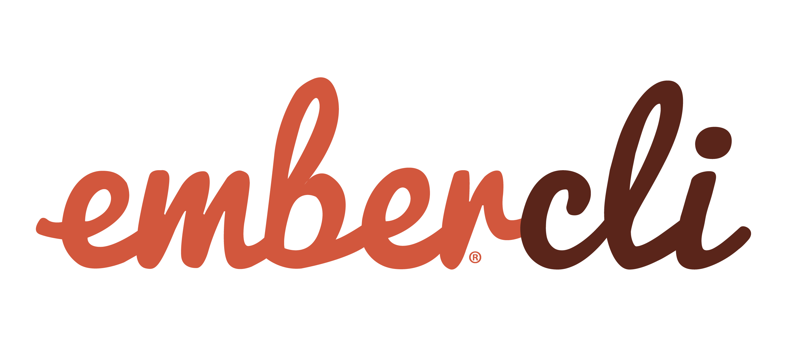
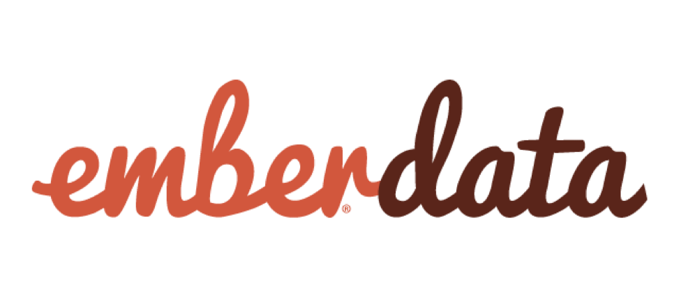
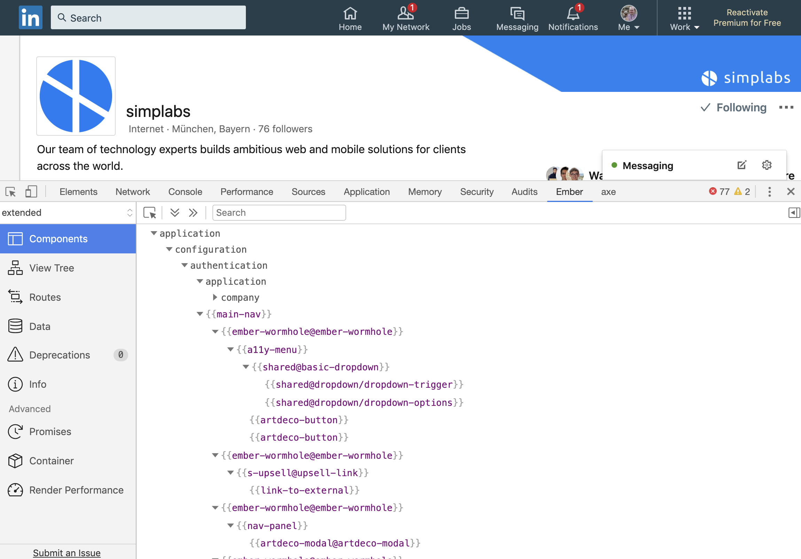
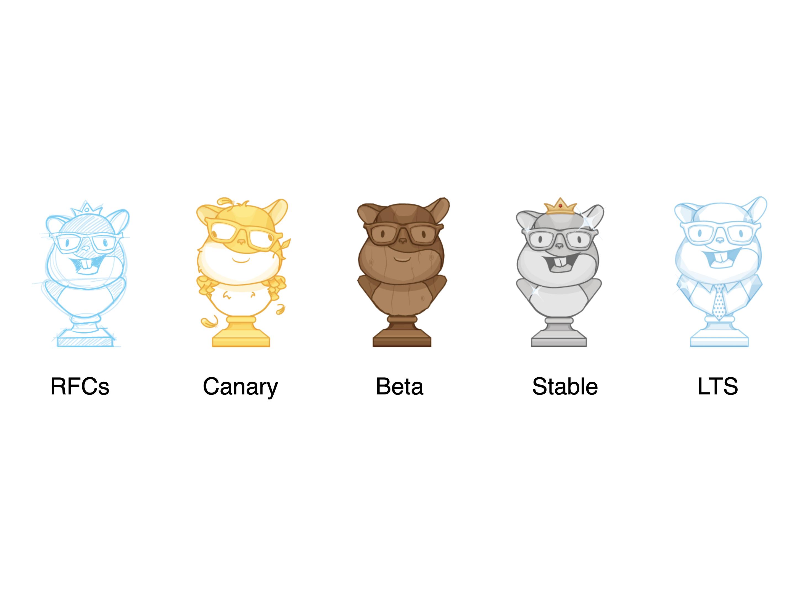
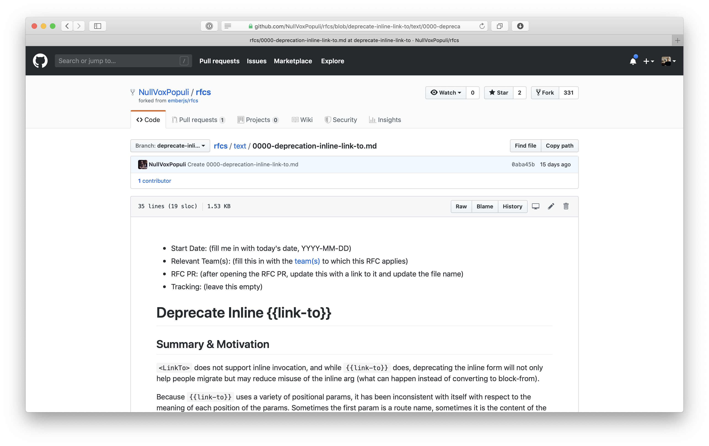
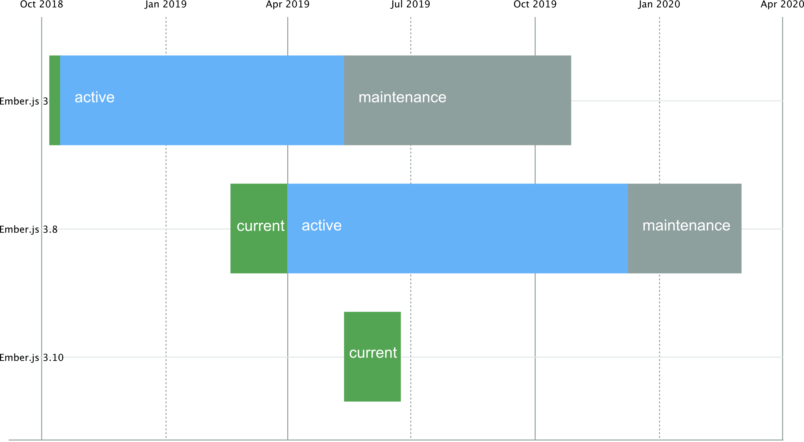

# Introduction

---


https://mainmatter.com

@mainmatter

---

## Introduction to Ember.js

---

# Ember History

Note:

Sproutcore etc.

---

## SproutCore

created in 2007 by Sproutit for their Mailroom app

Note:

created by Charles Jolley

---

## Apple, Inc.

Apple used SproutCore for the iCloud/iWork web services and contributed back

Note:

Jolley later joined Apple

---

## SproutCore 2.0

was announced mid 2011 and was meant to split the core from the UI widgets

Note:

Yehuda Katz and Tom Dale were lead developers at Strobe, Inc.

---

## Ember.js

eventually SproutCore 2.0 was so different from its previous version that is was renamed to Ember.js

Note:

first "Amber" actually but there was a naming conflict with another OSS project (http://amber-lang.net)

---

## Ember.js and LinkedIn

LinkedIn rebuilt their entire UI based on Ember.js

Note:

huge win for the community and project as there’s now a powerful force behind the project (similar to Facebook for React and Google for Angular, although not quite the same level)

---

## What is Ember.js?

"A framework for **ambitious** web developers."

Note:

allows you to build impressive UIs, far beyond what’s possible with HTML, jQuery etc.

---

Ember.js manages the complete application, not just keeping the DOM in sync with some backing data

Note:

as e.g. React does

---

Ember is more than just MVC

Note:

MVC is a pattern for UI components only

Ember handles the complete app, user flow, loading of data, building etc.

---

It leverages Conventions over Configuration as popularized by Ruby on Rails

---

## Parts of Ember.js

---


the base Framework with the core functionality
https://github.com/emberjs/ember.js

Note:

routing, rendering, UI state management etc.

---



the command line interface

https://github.com/ember-cli/ember-cli

Note:

- command line interface
- mostly deals with building projects

---



the data persistence library

https://github.com/emberjs/data

Note:

- implements the model layer
- interacts with api servers
- (this is optional)

---

### Ember Inspector

Developer Tools extension for Chrome and Firefox

Note: 

- debug your applications
- you can use it to inspect live apps

---
 


Note:

We will be using the Inspector throughout the workshop to better understand what's actually going on in the application

---


transpiles ES* code to ES5 that runs in all browsers

https://babeljs.io

---

### `ES\<YYYY\>`

ES2015, ES2016, ES2017, ES2018, ES2019

---

We'll be using some of the latest JS syntax and features throughout the workshop so here's a brief overview of the most important ones

---

### Modules

allow splitting up code bases into isolated parts with a clear interface between them

---

```js
// foo.js
export default function foo() {
  console.log('foo');
}

export bar = 1;

// bar.js
import foo, { bar } from './foo';

foo();
// => 'foo'

console.log(bar);
// => 1
```

Note:

- foo is the default export of foo.js
- bar is a named export
- modules can have 0 or 1 default exports and n named exports

---

### `const` and `let`

are keywords for defining constants and variables

---

```js
if (false) {
  let x = 1;
}
console.log(x);
// => ReferenceError

const Y = 1;
Y = 2;
// => SyntaxError

const Z;
// => SyntaxError
```

Note:

- var would not trigger an error here
- be aware though that const values can be mutated, just not reassigned
- try this!

---

### Arrow functions

allow for a more expressive closure syntax and use lexical scoping

---

```js
function Person(){
  this.age = 0;

  let self = this;
  setInterval(function() {
    self.age++;
  }, 1000);
}

let p = new Person();
```

inside the callback, this is not what it is outside of it (it’s the global this, e.g. the window in the browser)

---

### Template Strings

allow emberdded expresions in Strings

Note:

(and also multiline strings)

---

```
let a = 5;
let b = 10;

console.log(`Fifteen is ${a + b}.`);
```

Note:

try this

---

### Default parameters

allow for function parameters with default values if no value is specified

---

```js
function multiply(a, b = 1) {
  return a * b;
}

multiply(5); // => 5
```

---

### Rest parameters

allow a function to accept a variable number of params as an array

---

```js
function multiply(multiplier, ...values) {
  return values.map(function (element) {
    return multiplier * element;
  });
}

let arr = multiply(2, 1, 2, 3); 
console.log(arr); // [2, 4, 6]
```

---

### Shorthand property names

allow assigning variables as object properties with shorter syntax

---

```js
let a = 'foo'; 
let b = 42;
let c = {};

let o = { a, b, c };
// => o = { a: 'foo', b: 42,c: {} }
```

---

### Shorthand method names

allow defining methods with shorter syntax

---

```js
let obj = {
  foo() {},

  bar() {}
};
```

---

### Destructuring assignments

can be used to extract data from arrays or objects

---

```js
let [a, b] = [1, 2];
// => a = 1, b = 2

let { p, q } = { p: 42, q: true };
// => p = 42, q = true
```

---

### Spread operator

expands arrays into separate elements

---

```js
function myFunction(x, y, z) { }
let args = [0, 1, 2];

myFunction(...args);
```

---

```
init() {
  this._super(...arguments);

  this.prop = value;
}
```

Note:

we will use this mostly for calling `super` for framework methods

***

```
init() {
  this._super(...arguments);

  this.set('prop', value);
}
```

Note:

we will use this mostly for calling `super` for framework methods

---

## The Ember.js Release Cycle

---

&shy;<!-- .element: class="r-stretch" -->


Notes:

- 5 steps
- we'll go through one by one

---

&shy;<!-- .element: class="r-stretch" -->


RFCs are new features and changes are discussed in the open before implementation begins

---

&shy;<!-- .element: class="r-stretch" --> 


Note:

- everybody gets to join discussion
- once consensus, implementation can begin

---

&shy;<!-- .element: class="r-stretch" --> 


Canary builds are where new features land first

Note: 

this is basically the master branch

---

&shy;<!-- .element: class="r-stretch" --> 


Beta releases have new features that proved stable in Canary and are intended (but not guaranteed) to be released in the next stable release

---

&shy;<!-- .element: class="r-stretch" --> 


Stable releases contain everything that proved to be stable in the Beta phase

---

&shy;<!-- .element: class="r-stretch" --> 


Long Term Support releases are less frequently updated stable releases that receive backported fixes

---



Note:

- green is current latest
- blue is current LTS release

---

### Ember.js follows Semantic Versioning

`Major.Minor.Patch`

Note:

- Patch releases introduces bug fixed, security patches etc.
- Minor version releases introduce new features in a backwards compatible way
- Major version releases allow incompatible API changes

---

A new Minor Release is released every 6 weeks including whatever is deemed stable enough to be used in production applications

---

Minor releases introduce new features and deprecate old ones

---

Major releases do not introduce any new features but only remove previously deprecated cruft

Note:

With this mechanism going from the latest minor release to the next major release only requires updating the version given there are no deprecations

---

Ember.js, Ember CLI's and Ember Data's  versions are synchronized

---

We are using the latest stable release for this workshop (currently 3.22.x)

---

## Installation

---

### node/npm

```txt
install via homebrew or download an installer
```

https://nodejs.org/en/download/

---

### Yarn

```txt
npm install -g yarn
```

https://yarnpkg.com

---

### ember-cli

```txt
npm install -g ember-cli
```

https://github.com/ember-cli/ember-cli/releases/tag/v3.10.0

---

### If you are on Windows

```
npm install ember-cli-windows -g
ember-cli-windows
```

https://github.com/adopted-ember-addons/ember-cli-windows

---

### Ember Inspector

for Chrome and Firefox

- https://chrome.google.com/webstore/detail/ember-inspector/bmdblncegkenkacieihfhpjfppoconhi  
- https://addons.mozilla.org/firefox/addon/ember-inspector/

---

### git

```txt
brew install git
```

or download an installer

https://git-scm.com

---

### Run the sample application

```txt
git clone https://github.com/simplabs/ember-workshop.git
cd ember-workshop
git checkout tomster-player
yarn --pure-lockfile
cd tomster-player
yarn start
```

https://github.com/simplabs/ember-workshop

---

### Bootstrap your own application

```txt
git clone https://github.com/simplabs/ember-workshop.git
cd ember-workshop
git branch <your-branch-name> step-0
yarn install —-pure-lockfile
cd tomster-player
ember serve
```

https://github.com/simplabs/ember-workshop

---


https://mainmatter.com

@mainmatter
